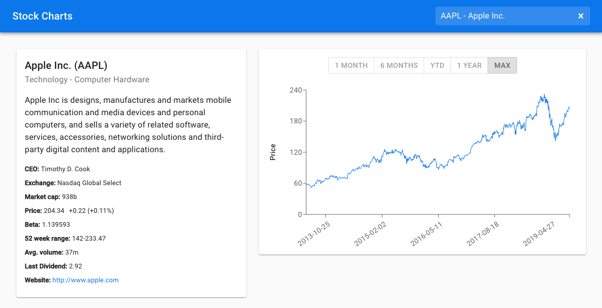

# Stock Charts

_Stock Charts_ is a sample application to demonstrate best practices in testing.
Hope you will find it useful.
[Feedback welcome!](https://twitter.com/NareshJBhatia)

## The Application

The application consists of a single page that displays information about a
stock. Here's a screen shot to give you an idea:



## Build

```bash
$ yarn
$ yarn start
```

Now point your browser to http://localhost:3000/.

## Test

Execute the following command to run tests in interactive mode:

```bash
yarn test
```

Execute the following command to run all tests and show test coverage.

```bash
yarn test --watchAll=false --coverage
```
